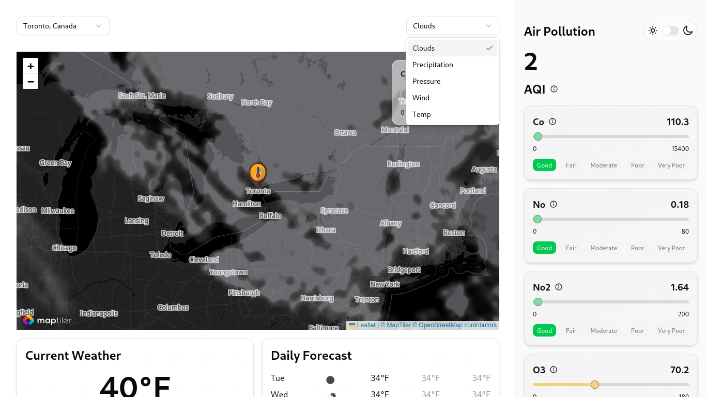
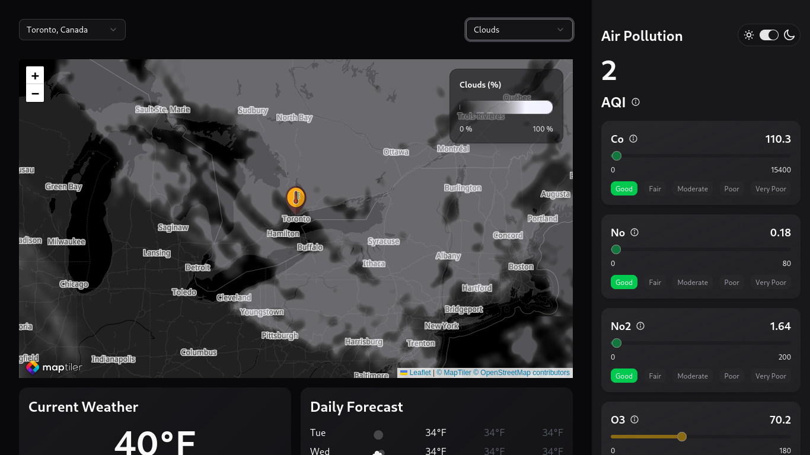
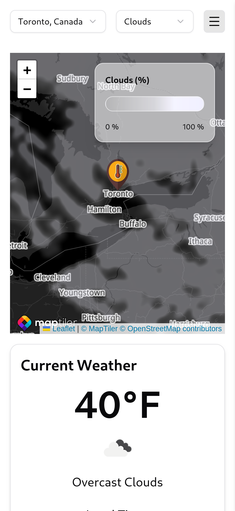
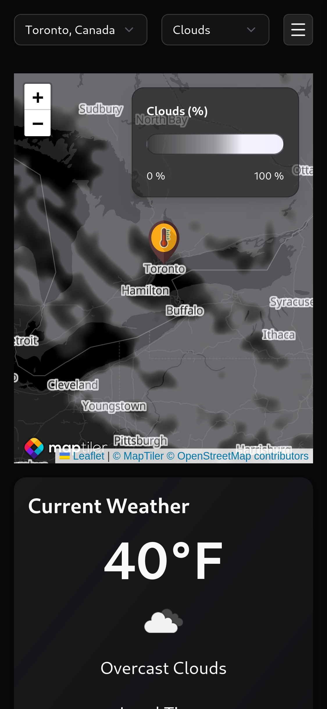

# 🌤️ Weathora


Weathora is a modern weather app built with **React, TypeScript, TailwindCSS, Shadcn UI, and Leaflet**, integrating the **OpenWeather API** and **MapTiler** for interactive maps. It provides **current weather**, **3-hourly forecast**, **daily forecast**, and **air quality information**.  

Supports **dark mode**, **light mode**, **desktop and mobile views**, and **geolocation-based fetching**.

---

## 🚀 Features

- Fetch **current weather**, **3-hourly forecast**, and **5-day forecast** in **°F** using OpenWeather API.
- Detects your location via **browser geolocation**.
- Displays **interactive maps** using **Leaflet** and **MapTiler** with dark/light tile layers.
- **Air quality index** integration.
- Fully **responsive design** for desktop and mobile.
- **Dark mode / Light mode toggle**.
- Modern UI components using **TailwindCSS + Shadcn UI**.
- Type-safe API fetching using **Zod**.

---

## 🛠️ Tech Stack

- **Frontend:** React, TypeScript, TailwindCSS, Shadcn UI, Lucide React icons
- **Maps:** Leaflet, MapTiler
- **API:** OpenWeather 2.5 (current, forecast, air pollution), Geocoding API
- **State & Fetching:** React Query
- **Utilities:** clsx, class-variance-authority, tailwind-merge, Zod

---

## 📂 Folder Structure (Relevant)

```
src/
├── api/             # API calls (weather, forecast, air quality, geocode)
├── components/      # UI components (cards, dropdowns, header, map, sidebar)
├── context/         # Theme context & provider
├── hooks/           # Custom hooks (useTheme)
├── config/          # Config data
├── assets/          # Images, icons, constants
├── lib/             # Utility functions
└── schemas/         # API response validation using Zod
```

---

## ⚡ Screenshots

| Desktop View Light Mode                              | Desktop View Dark Mode                               |
| ---------------------------------------------------- | --------------------------------------------------- |
|    |     |

| Mobile View Light Mode                               | Mobile View Dark Mode                                |
| ---------------------------------------------------- | --------------------------------------------------- |
|      |       |

> Screenshots show the app on desktop and mobile, with both dark and light themes active.

---

## 📌 Getting Started

### 1. Clone the repo

```bash
git clone https://github.com/grep-many/weathora.git
cd weathora
```

### 2. Install dependencies

```bash
npm install
```

### 3. Configure Environment Variables

Create a `.env` file in the root:

```env
VITE_OPENWEATHER_API_KEY=your_openweather_api_key
VITE_MAPTILER_KEY=your_maptiler_key
```

### 4. Run Development Server

```bash
npm run dev
```

Open `http://localhost:5173/weathora` in your browser.

---

## 🔍 Usage

- Toggle between **dark** and **light** themes using the switch in the header.
- The map displays your **current location**, using browser geolocation.
- Click on locations on the map to fetch their **weather and air quality data**.
- Scroll through the **3-hourly forecast** and **daily forecast** cards.

---

## 🧩 API Structure

- `src/api/weather/current.ts` → Fetch current weather by `lat/lon`.
- `src/api/weather/forecast.ts` → Fetch 5-day 3-hourly forecast.
- `src/api/airQuality.ts` → Fetch air pollution index by `lat/lon`.
- `src/api/geoCode.ts` → fetches location names to array of `lat/lon`.

---

## 📝 Scripts

| Command                | Description                         |
| ---------------------- | ----------------------------------- |
| `npm run dev`           | Start development server            |
| `npm run build`         | Build production bundle             |
| `npm run preview`       | Preview production build            |
| `npm run lint`          | Lint project with ESLint            |
| `npm run prettier:check`| Check code formatting               |
| `npm run prettier:write`| Format code automatically           |

---

## 🌐 Live Demo

> [https://grep-many.github.io/weathora/](https://grep-many.github.io/weathora/)

---

## 📖 Notes

- Temperatures are displayed in **°F** (imperial units).
- Map uses **dark tile layer** when in dark mode.
- Initial location detection uses `navigator.geolocation`.
- Fully responsive with **mobile-first TailwindCSS design**.
